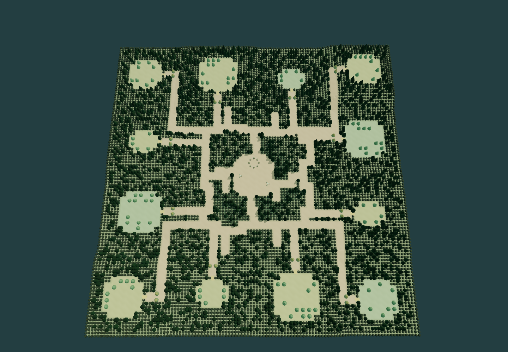

# THORNHOLD — A última clareira

Jogo 3D em terceira pessoa: um Troll caça de um a oito Elfos que precisam explorar, construir economia e defender suas clareiras. Código, modelos geométricos, interface, mapa e efeitos sonoros originais. Candidata **0.2.0-alpha.2**, com simulação autoritativa e multiplayer WebSocket real.



## Jogar

Requer Node.js 22 ou superior e navegador desktop com WebGL 2. Teclado e mouse.

```powershell
npm ci
npm start
```

Abra **http://localhost:3000**. No Windows, também é possível executar **Iniciar Thornhold.cmd**. As dependências já instaladas permitem jogar sem CDN ou conexão com serviços externos.

A interface inicia em português. Use o botão **EN/PT** no cabeçalho ou no HUD para alternar para inglês durante a partida; a preferência fica salva neste navegador.

1. Escolha **Jogar contra bots**, seu papel e a quantidade de Elfos.
2. No lobby, configure seed, preparação, mapa e bots; marque **Estou pronto**.
3. Inicie. Como Elfo, siga uma trilha até uma clareira e construa o núcleo; como Troll, aguarde o selo cair.
4. A vitória leva ao resultado. O host escolhe **Revanche · voltar ao lobby**; os participantes permanecem conectados.

Para uma partida inteiramente autônoma, use **Observar partida**, preencha seu slot com um bot, marque Ready e inicie. O observador alterna personagens com Tab.

## Amigos e multiplayer

O processo Node é o servidor da partida, não o navegador do host. O host tem permissão para configurar a sala; fechar seu navegador não interrompe o processo servidor.

- **Na mesma máquina:** abra duas janelas/perfis ou abas independentes, entre no mesmo endereço e use o código da sala. Uma aba duplicada pode herdar o token da aba original; prefira uma nova aba digitando o endereço ou outro perfil.
- **Na rede local:** os amigos abrem `http://IP-DO-SERVIDOR:3000`, criam/entram em uma sala privada e informam seu código. A rede e o firewall precisam permitir acesso à porta. O programa não altera o firewall automaticamente.
- **Pela internet:** execute este mesmo servidor em uma máquina com endereço público e HTTPS/WSS. Há um Dockerfile incluído. Convites são locais ao servidor; um código de sala não cria um túnel nem torna `localhost` acessível pela internet.
- **Quick Play:** procura a sala pública em espera mais preenchida, com vagas, na região escolhida; cria uma se não encontrar. Todas as salas deste processo compartilham o mesmo ponto de acesso e, portanto, a mesma medição de ping. Não há infraestrutura regional distribuída nesta versão.
- **Sala local:** aceita apenas seu criador e bots. Para convidar amigos, crie uma sala privada ou pública.

## Controles

| Ação | Controle |
|---|---|
| Movimento / correr | WASD / Shift |
| Câmera / mira / zoom | Clique no cenário para começar; mova o mouse / mira central / roda |
| Liberar cursor / voltar à câmera | Clique na bolinha do mouse |
| Selecionar árvore ou construção | Clique esquerdo |
| Construir | 1–5, aponte o projeto, clique ou Enter |
| Girar projeto / alternar snap | R / G |
| Coletar / ajudar obra | E; segure para repetir |
| Reparar estrutura selecionada | R; segure para repetir |
| Ataque Troll / pesado | Clique ou segurar clique / Q |
| Esquiva do Troll / habilidade de papel | Espaço / F |
| Loja / atributos do Troll | B |
| Formar e evoluir Wisps no núcleo | N ou clique no recurso madeira |
| Evoluir seleção / formar Wisp no núcleo selecionado | U / T |
| Repetir a mesma construção | Shift + clique ou Shift + Enter |
| Mapa ampliado / voltar ao personagem | M / C |
| Observar região ou aliado sob ataque | Clique no mapa ou no alerta da equipe |
| Sinalizar aliados | V; no mapa, Shift + clique = perigo e botão direito = ajuda |
| Cancelar projeto, destino ou fechar seleção | Esc ou botão direito |
| Menu, quando não há ação ou painel aberto | Esc |
| Guia / alternar observado | H / Tab |

Pressione `V` para abrir a roda de comunicação. Ela separa perigo, ajuda, ataque, defesa e pedidos de ouro/madeira; os pedidos são coordenação, não transferência direta de recursos.

A Barricada é reparada gratuitamente. O primeiro Elfo canalizando aplica 100% do reparo; cada ajudante simultâneo aplica 25%. O reparo das demais estruturas continua consumindo 3 de ouro e 1 de madeira.

Elfos podem construir apoio em uma clareira aliada ativa. A estrutura pertence a quem pagou — somente esse jogador pode evoluir ou cancelar — e os limites de 1 Núcleo, 1 Barricada, 5 Torres, 5 Minas e 1 Oficina valem para a clareira inteira. Recursos permanecem pessoais e não podem ser transferidos diretamente.

O Núcleo libera uma vaga de Mina por nível, até cinco. A cada nível, o custo-base da nova Mina cresce 25% e a produção de todas as Minas vinculadas cresce 30%; destruir o Núcleo interrompe essa produção.

Quando um Elfo morre, seus recursos são perdidos e todas as estruturas e Wisps que lhe pertencem colapsam. O Troll recebe 25% da recompensa normal restante; estruturas de outros proprietários sobrevivem. A clareira do Núcleo caído fica bloqueada por 15 segundos antes de poder ser reivindicada por um aliado vivo.

O Elfo eliminado retorna como Espírito controlável com visão curta. Ele não causa dano nem impede a vitória do Troll, mas pode revelar uma área de 18 m por 10 segundos a cada 60 segundos e reparar Barricadas a 50% da velocidade-base. O Troll vê e pode matar o Espírito por 25 de ouro; essa segunda morte não conta como nova eliminação e encerra a participação ativa do jogador.

Não há vitória por limite de tempo. No Tier 10, uma única Torre élfica viva ascende a Lendária e canaliza um raio cujo dano cresce enquanto mantém linha de visão; perder visão ou sofrer Rugido reinicia o acúmulo. Para o Troll, Fúria + Quebra-fortaleza somando 10 libera a Espada Lendária: qualquer golpe executa uma estrutura que termine abaixo de 15% de HP.

Obras precisam de um construtor vivo por perto. A barricada encaixa somente no portão da sua clareira. Elfos atravessam portões aliados; o Troll precisa destruí-los. Após uma ruptura, a entrada fica 12 segundos sem reconstrução e não aceita novas fundações com o Troll a menos de 5 metros.

Depois que sua Barricada é rompida, um Elfo próximo pode usar **F** para atordoar o Troll por três segundos. A recarga de 60 segundos é compartilhada pela equipe. Se o Núcleo for destruído, o Elfo sobrevivente tem 60 segundos para alcançar outra clareira e usar seu voucher único de reassentamento: o próximo Núcleo não consome ouro nem madeira.

O cursor livre permite selecionar estruturas e usar os painéis. Loja, ajuda e mapa liberam o cursor automaticamente; a bolinha do mouse retorna à câmera. Ao observar outra região, seu personagem permanece parado: **C** retorna ao personagem, **M** fecha o mapa. A partida continua nesses painéis.

Uma construção confirmada encerra o projeto; segure **Shift** para continuar colocando. **E** mostra e executa a interação próxima. Wisps orbitam as árvores com brilho, rastro e marcador clicável de produção; o botão **Localizar** permite inspecioná-los. **Esc** fecha o contexto atual sem desfazer investimentos. Para cancelar uma obra, formação ou evolução ainda em andamento, use seu botão **Cancelar**, que mostra a devolução de 75% da parte ainda não executada. Exige proximidade e cinco segundos sem dano no alvo. Dicas permanentes podem ser desligadas no menu.

O menu **Acessibilidade e controles** permite remapear movimento, combate e interface, ajustar a UI entre 90% e 125% e reduzir animações, partículas e movimento de câmera. As preferências ficam salvas no navegador; modo daltônico não faz parte deste ciclo.

Detalhes do desenho e dos fluxos: [HUD e interação](docs/HUD-E-INTERACAO.md).

O Troll aparece como um losango laranja quando a equipe o avista. Ao sair da visão, um círculo tracejado marca **a última posição conhecida por até 12 segundos**, sem acompanhar seus movimentos ocultos. Pings duram 10 segundos e têm intervalo de 3 segundos. Lentidão, bloqueio de regeneração, exposição, selo e torres desativadas mostram seus prazos; efeitos condicionais, como fome, explicam como encerrá-los.

## Sistemas conectados

- Criação/entrada por código e senha, browser público, filtros, Quick Play, troca de papel, mover humanos, adicionar/remover bots, abrir/fechar slots, Ready, host migrado, resultado e revanche.
- Um único `Match` para humanos e IA. Desconexões podem transferir o mesmo personagem para IA. Recarregar a aba retoma a sessão por token enquanto o servidor e a sala permanecem ativos.
- Mapa determinístico com doze refúgios de três tamanhos e quantidades diferentes de árvores, cada uma com estoque atual de 1.000 madeiras, além de platôs e baixadas ligados por rampas. Trilhas com bifurcações atravessam uma floresta sólida; o minimapa revela o terreno explorado. Cada clareira tem um único portão validado pelo servidor.
- Núcleo com renda crescente, barricada reparável, cinco torres por Elfo, quatro especializações de torre, mina e oficina. Obras, coleta, melhorias e destruição usam recursos reais e alteram o estado compartilhado.
- Wisps formados no núcleo: um por árvore, produção contínua sem consumir o tronco, evolução sem nível máximo e transferência para árvores externas com maior rendimento e exposição. Árvores esgotadas pela coleta manual rebrotam após 35 segundos se não houver uma construção no local.
- Loja do Troll com nove equipamentos, três espaços e sugestões de Cerco, Caçador e Sustentação. Itens comprados ficam na coleção; trocar exige cinco segundos fora de combate. Oito atributos e tiers de estruturas evoluem sem limite de nível, com custos crescentes e ganhos decrescentes de velocidade.
- Ataques leves/pesados com preparação e alcance verificados no impacto, combo de três acertos, esquiva que cancela a preparação e fortalece o próximo golpe, rugido e feedback de ruptura. Dano aplicado gera ouro, limitado pelo HP real e pelo orçamento de recompensa da estrutura.
- Visão por distância e linha de visão. O servidor omite inimigos escondidos e sua economia dos snapshots. Bots do Troll descobrem terreno e alvos pela visão; não consultam o cadastro de bases para caçá-las.
- Melhorias de estruturas e atributos do Troll ficam disponíveis sem bloqueio temporal. O Núcleo exige uma Barricada ativa: níveis 2–3 pedem Barricada 1, níveis 4–5 pedem Barricada 2, e assim por diante. Aos 3:30, a Era do Cerco ainda amplia recursos externos e o bônus de cerco; a fome começa após 8:00 se o Troll passar 45 segundos sem causar dano.
- Transferência de recursos, assistência a obras e reparo aliado. Elfos eliminados acompanham a visão da equipe e conservam um sinal de ajuda limitado.
- Modelos estilizados procedurais, animação de caminhada/ataque, projéteis, partículas, estágios de dano, áudio sintetizado, HUD, seleção 3D, ghost e minimapa de exploração.

## Verificar e balancear

- [Auditoria de jogabilidade — 23/09/2026](docs/AUDITORIA-DE-JOGABILIDADE.md): comparação após as melhorias de HUD, evidências de ritmo, lacunas e prioridades de desenvolvimento.
- [Guia de referências de Troll & Elves](docs/REFERENCIAS-TROLL-E-ELFOS.md): fontes verificadas, diferenças entre versões e resultado da busca por uma wiki abrangente.

```powershell
npm run verify
npm test
npm run balance
npm run simulate -- 240
npm run audit:combat
npm run audit:progression -- 6 artifacts/progression-current-20hz.json
```

- `npm test`: regras, física, economia, fog, mapa, simulações completas e cenários de rede A–G com conexões WebSocket independentes.
- `npm run verify`: sintaxe, testes de regras/rede e os fluxos críticos de navegador para upgrades, recursos, stun, reassentamento, placar, resultado, alternância PT-BR/EN e preferências de acessibilidade.
- `npm run balance`: HP, DPS, tempo para romper barricada, tempo para matar o Troll e retorno do investimento econômico por tier. Gera `artifacts/balance.json`.
- `npm run simulate -- 240`: partidas determinísticas em 1v2/1v3/1v5/1v8 e três dificuldades. Gera `artifacts/simulations.json`, incluindo win rate, duração, dano, renda, primeira ruptura, melhorias e sobreviventes. O teste não concede bônus de vitória nem altera regras por resultado.
- O servidor grava resultados reais em `telemetry/matches.jsonl`.
- `npm run audit:combat`: 126 cenários controlados com o combate real, reparo, habilidades e exposição. Gera `artifacts/combat-audit.json`; a arena sintética não representa uma clareira legal.
- `npm run audit:progression -- 6 CAMINHO`: 72 partidas pareadas a 20 Hz, dificuldade separada por papel, compras, economia, comandos rejeitados e duração. Partidas sem vencedor em 25 min são registradas e fazem o comando retornar código 1.
- [Progressão infinita, Wisps e combate](docs/PROGRESSAO-INFINITA-E-COMBATE.md): regras implementadas, builds, custos, testes e próximos ajustes. O lote atual terminou com 38 vitórias do Troll, 32 dos Elfos e duas partidas sem vencedor aos 25 minutos; apenas oito das 72 ficaram na meta de **12–18 minutos**.
- [Auditoria anterior](docs/BALANCEAMENTO-E-PROGRESSAO.md): pesquisa das variantes e diagnóstico antes da progressão infinita; mantida como histórico.
- `scripts/browser-check.js`, `scripts/browser-gameplay.js`, `scripts/browser-lifecycle.js`, `scripts/browser-controls.js`, `scripts/browser-progression.js` e `scripts/browser-hud.js` verificam a interface, construção, resultado, revanche, câmera, loja, Wisps, combate e cancelamento em uma sessão Chrome isolada via CDP. Consulte `docs/VALIDACAO.md`.

Balanceamento principal em `shared/config.js`. Os relatórios são uma linha de base de bots, **não uma comprovação de equilíbrio competitivo humano**. A variação por tamanho de lobby permanece um ponto de ajuste.

A IA do Troll avalia o risco das torres observadas, mantém compromisso com alvos, persegue Elfos expostos, recua para pontos seguros, regenera e retorna ou troca de frente. Compras respondem ao combate. As referências do modo e as adaptações estão em [docs/MODO-E-TATICAS.md](docs/MODO-E-TATICAS.md).

## Organização

```text
client/       Interface, controles, áudio e renderização Three.js
shared/       Configuração, geração, pathfinding, simulação e controladores
server/       HTTP, WebSocket, sessões, autoridade e telemetria
tests/        Testes automatizados de regras e rede
scripts/      Simulação, análise e testes reais de navegador
docs/         Arquitetura e escopo de validação
artifacts/    Relatórios e capturas gerados; ignorado pelo Git
```

## Limites desta entrega

É um slice desktop com arte procedural e persistência de sessão em memória. Reiniciar o servidor encerra suas salas. Não inclui autenticação de conta, ranking, relay/NAT traversal, voz, matchmaking entre servidores, assets artísticos finais nem controles touch. O modo observador tem informação completa e deve ser usado para testes ou espectadores confiáveis; jogadores eliminados recebem somente a visão da equipe. A arquitetura não pretende oferecer proteção contra conluio entre espectadores e jogadores.

O servidor está implementado para operação local/LAN e publicação em um host Node persistente; **nenhum serviço público foi contratado ou publicado automaticamente**.

Escopo aprovado e sequência para a alpha: [Backlog v0.2 Alpha](docs/BACKLOG-V0.2-ALPHA.md).

Referências de dependências: [Three.js — instalação](https://threejs.org/manual/en/installation.html) e [ws — servidor WebSocket](https://github.com/websockets/ws). Nenhum asset de Warcraft ou Dota é utilizado.

- [Mapa da caçada](docs/MAPA-DA-CACADA.md): referências, reconstrução do terreno, física compartilhada, testes e capturas.
